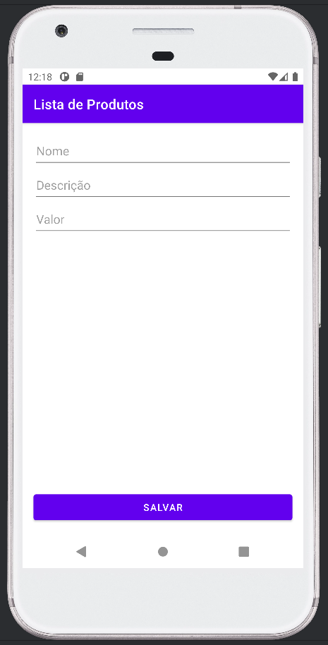
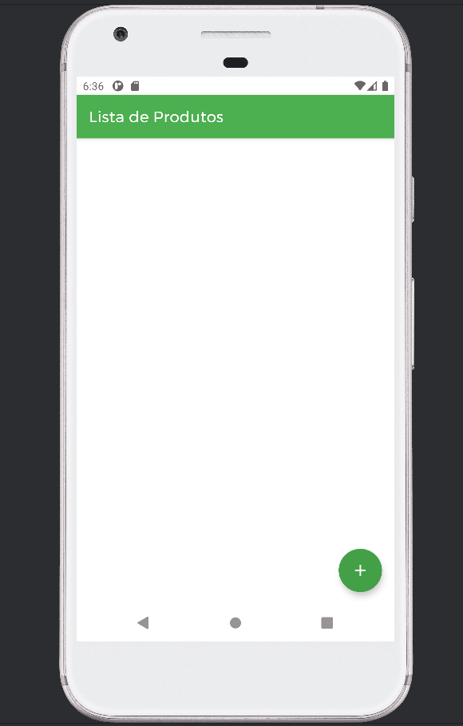

# Lista de Produtos

O projeto consiste em uma aplicação kotlin para android composta por uma lista de produtos e um formulário de cadastro de produto.

## Primeiro check point

| Tela Principal                       | Formulário de Cadastro de Produtos |
|--------------------------------------|------------------------------------|
|  |   |

